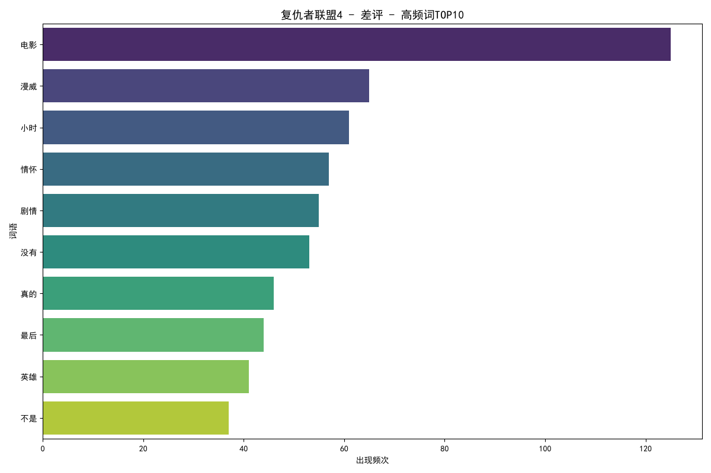
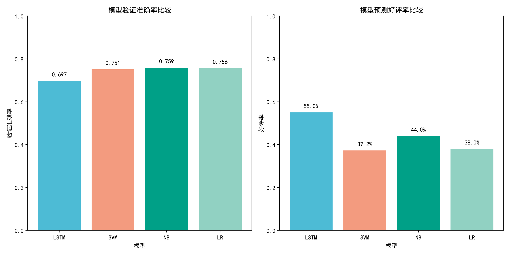
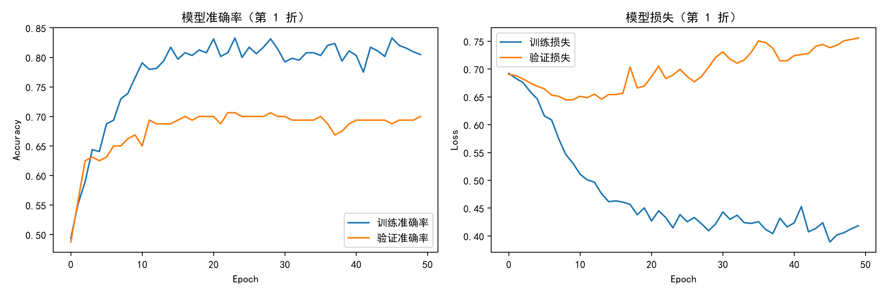

<div align="center">

# 两部漫威电影的豆瓣短评，到底差在哪？

**2400 条豆瓣短评 · jieba 分词词云与 LDA 主题建模 · SnowNLP 情感分析 · 四模型文本分类对比**

</div>

---

## 一句话结论

> 在**两部影片各 1200 条**豆瓣短评上，SnowNLP 给出的结论是"两部都是约 **75% 正面**、几乎没有差别"；
> 但用豆瓣自带的好评/差评标注去校准就会发现，这个数字**不可直接引用**——SnowNLP 把 **61.95% 的差评**
> 也判成了正面。真正把两部影片分开的是词频结构与分类模型：复联4 的差评集中在"**小时**"（三小时片长）
> 与"剧情"，好评集中在"十年""钢铁侠""情怀"；而雷霆特工队的对比结果（"一般"评论仅 **5.75%–12.25%**
> 被判为好评）并非模型失效，而是**数据本身失效**——该影片"一般"档位的短评与"差评"档位**完全重合**
> （397 条，Jaccard = 1.000）。此外四个模型都严重过拟合：训练准确率 0.957–0.980，
> 验证准确率只有 **0.633–0.759**，且 **LSTM 在两个任务上都是四者中最差的**。

完整数值记录见 [`results.md`](results.md)，逐条预测结果见 [`output/tables/`](output/tables)。

---

## 目录

- [一、研究问题：为什么不能直接看"情感得分"](#一研究问题为什么不能直接看情感得分)
- [二、核心发现](#二核心发现)
- [三、方法与工程选择](#三方法与工程选择)
- [四、结果](#四结果)
- [五、项目结构](#五项目结构)
- [六、复现指南](#六复现指南)
- [七、这个项目体现了哪些能力](#七这个项目体现了哪些能力)
- [八、已知问题与后续计划](#八已知问题与后续计划)
- [九、参考文献与数据来源](#九参考文献与数据来源)
- [十、致谢与-AI-使用声明](#十致谢与-ai-使用声明)

---

## 一、研究问题：为什么不能直接看"情感得分"

项目最初的目标很朴素：**比较《复仇者联盟4：终局之战》与《雷霆特工队*》的观众口碑差异**。
最直接的做法是抓短评、跑情感分析、比正面比例。但数据本身立刻否定了这条路。

**（1）现成情感模型的分数严重偏正。** 用 `snownlp` 对 2400 条短评逐条打分（阈值 0.4 / 0.6）：

| 影片 | 有效样本 | 正面 | 负面 | 中性 | 得分均值 | 得分中位数 |
|------|---------|------|------|------|---------|-----------|
| 复仇者联盟4 | 1164 | 885（**76.03%**） | 194（16.67%） | 85（7.30%） | 0.7863 | 0.9891 |
| 雷霆特工队 | 1168 | 869（**74.40%**） | 204（17.47%） | 95（8.13%） | 0.7708 | 0.9703 |

两部影片相差 **1.63 个百分点**，中位数都在 0.97 以上——看起来"观众对两部都很满意"。
但只要拿豆瓣自己的好评/差评标注做一次交叉验证，这个结论就站不住了：

| 标注 \ SnowNLP（复联4） | negative | neutral | positive |
|------------------------|----------|---------|----------|
| 好评（n = 384） | 28 | 20 | 336 |
| 差评（n = 389） | 113 | 35 | **241** |
| 一般（n = 391） | 53 | 30 | 308 |

SnowNLP 对好评/差评**有方向性区分**（好评均值 0.8864 vs 差评均值 0.6663，差 **0.2201**），
但**绝对阈值完全不可用**——差评里有 **61.95%** 仍被判为正面。所谓"76% 正面"是模型的
乐观偏置，不能读作观众满意度。

**（2）"一般"评论的语义位置本身是未知的。** 短评的星级档位是作者标注的，但"三星/一般"
往往意味着"说不上好也说不上坏"。要回答"中间派更偏向哪一边"，需要让模型在有明确标签的
好评/差评上学出判别边界，再把这把尺子用到"一般"评论上——而不是用人设定的阈值。

**（3）数据本身可能不可信。** 抓取脚本按豆瓣的 `percent_type`（h/l/m）分档取数。核验发现
雷霆特工队的 `m`（一般）档位返回的评论与 `l`（差评）档位**完全一致**，说明该档位抓取失效。
任何基于这份数据的"口碑对比"都必须先承认这一点。

因此本项目的重心不是"再跑一遍情感分析"，而是：**在承认数据与工具都有缺陷的前提下，
用多种互补方法交叉验证，看哪些结论真的站得住。**

---

## 二、核心发现

| 结论 | 证据来源 | 关键数值 |
|------|----------|----------|
| 现成情感模型的绝对阈值不可用 | SnowNLP 判定 vs 豆瓣标注交叉表 | 差评中 **61.95%** 被判为正面；好评/差评得分均值差 0.2201 |
| 情感得分仍有方向性信息 | 按标注分组的得分统计 | 好评 0.8864 / 差评 0.6663 / 一般 0.8074（复联4） |
| 复联4 的差评指向"片长与剧情" | [`output/tables/topwords_av.csv`](output/tables/topwords_av.csv) | 差评高频词：电影(125)、漫威(65)、**小时(61)**、情怀(57)、剧情(55) |
| 复联4 的好评指向"系列情怀" | 同上 | 好评高频词：漫威(157)、电影(125)、**十年(75)**、最后(66)、**钢铁侠(61)**、英雄(58) |
| 雷霆特工队的好/差评区分度更弱 | 同上 | 两档共享"漫威""电影""没有""真的"；区别仅在"喜欢/故事" vs "无聊" |
| 四个模型都严重过拟合 | [`output/tables/av_classified_comments_model_metrics.csv`](output/tables/av_classified_comments_model_metrics.csv) | 训练准确率 0.9569–0.9803 vs 验证准确率 **0.6325–0.7587** |
| 深度学习在小样本上未胜出 | 四模型 5 折交叉验证 | LSTM 验证准确率最低（复联4 **0.6975**、雷霆 **0.6325**），低于线性模型 0.7162–0.7587 |
| 复联4 的"一般"评论确实难以判别 | 四模型判好评比例 | **37.25%–55.00%**（均值 43.56%），模型间分歧 17.75 个百分点 |
| 雷霆特工队的对比结果由数据缺陷导致 | 标签—文本一致性检查 | "一般" ∩ "差评" = **397 条，Jaccard = 1.000** |
| LDA 双主题结构偏弱 | [`output/figures/lda_topics_av.png`](output/figures/lda_topics_av.png) | 两个主题共享大量高频词，区分度有限 |

<table>
<tr>
<td width="50%"></td>
<td width="50%"></td>
</tr>
<tr>
<td align="center"><b>图 1</b>　《复仇者联盟4》差评词云：片长（"小时"）与剧情争议突出</td>
<td align="center"><b>图 2</b>　《复仇者联盟4》好评词云：十年、钢铁侠、情怀等系列情感词主导</td>
</tr>
</table>

<table>
<tr>
<td width="50%"></td>
<td width="50%"></td>
</tr>
<tr>
<td align="center"><b>图 3</b>　《雷霆特工队*》好评词云</td>
<td align="center"><b>图 4</b>　《雷霆特工队*》差评词云：与好评共享大量中性词</td>
</tr>
</table>

> **一句话解读**：两部影片的短评都不缺情绪，缺的是**可信的度量**。删掉不可信的部分之后，
> 剩下的可靠结论是"复联4 的争议点在片长与叙事节奏，雷霆特工队的口碑更分散"，
> 以及一条方法论结论——**用现成情感模型的比例数字直接做跨片对比，是会出错的**。

---

## 三、方法与工程选择

### 3.1 统一预处理

所有任务共用 [`scripts/text_cleaner.py`](scripts/text_cleaner.py) 中的 `DoubanTextCleaner`，
保证词云、情感分析、分类模型看到的是**完全一致**的文本。流程为：

1. **清洗**：去除标点、数字、英文字母、emoji 与零宽字符（`scripts/text_cleaner.py` 的
   `clean_text()` 中逐条列出 Unicode 区间）；
2. **分词**：`jieba.lcut`，并加载 `data/user.dict.utf8` 自定义词典，另补充"钢铁侠""雷霆特工队"
   "叶莲娜"等 14 个影视专有名词，避免人名与片名被切碎；
3. **过滤**：剔除停用词（`data/stopwords_hit.txt`，751 条）与单字词。

> **工程选择**：原实现使用 `r'[[:punct:]]'` 去除标点，但 Python 的 `re` 并不支持 POSIX
> 字符类——该写法实际被解析为一个包含 `[ : p u n c t` 的字符集，既触发 `FutureWarning`，
> 又意外删除若干拉丁字母。由于后续还有 `[a-zA-Z]` 与单字过滤兜底，最终结果没有变化，
> 但为消除隐患已改为 `r'[^\w\s]'`（Python 的 `\w` 可匹配汉字，因此只清标点）。

### 3.2 词云与 LDA 主题建模

- 词云：按"好评/差评/一般"分档，去重后统计词频，取前 200 词生成词云（`max_font_size = 100`）；
- 高频词条形图：取 TOP10 落盘为 PNG，同时把 TOP50 词频写入 CSV，便于核验与引用；
- LDA：`gensim` 实现，`num_topics = 2`（语料呈"认可/批评"二分）、`passes = 15`、
  `random_state = 42`；结果导出为 pyLDAvis 交互页。

> **工程选择**：词云需要**字体文件路径**而非字体族名，硬编码 `'simhei.ttf'` 在换机器后必然失败。
> 现改为通过 `matplotlib.font_manager.findfont()` 依次尝试 SimHei / 微软雅黑 / 宋体，
> 并在找不到时显式报错而不是静默出乱码。

### 3.3 SnowNLP 情感分析

对每条短评计算 `[0, 1]` 的情感得分，以 `0.4 / 0.6` 为阈值划为负面 / 中性 / 正面。
清洗后为空的评论不参与统计（复联4 跳过 36 条，雷霆特工队跳过 32 条）。

> **为什么不直接采信结果**：SnowNLP 在电商评论语料上训练，对影视短评存在系统性乐观偏置。
> 因此本项目额外做了一步**校准诊断**——把得分按豆瓣标注分组，检查模型是否真的能区分好评与差评。

### 3.4 四模型文本分类对比

任务设定：以"好评 / 差评"为训练集，预测"一般"评论的倾向。

$$
\text{训练集} = \{(x_i, y_i)\},\ y_i \in \{\text{差评}, \text{好评}\},
\qquad \text{预测集} = \{x_j \mid \text{Type}_j = \text{一般}\}
$$

对比的四个模型：

| 模型 | 特征 | 说明 |
|------|------|------|
| LSTM | Embedding(5000×256) → LSTM(8) | Keras 实现，`Dense(2, relu)` 低维投影 + `Dropout(0.6)` 抑制过拟合 |
| SVM | TF-IDF 5000 维 | 线性核，`probability=True` |
| 朴素贝叶斯 | TF-IDF 5000 维 | `MultinomialNB` |
| 逻辑回归 | TF-IDF 5000 维 | L2 正则，`max_iter=1000` |

评估采用 **5 折交叉验证**，并遵守两条防泄漏约束：**每次折内重新拟合分词器 / TF-IDF**
（只在本折训练数据上 `fit`），以及**每折重建模型**（LSTM 不跨折继承权重）。

> **工程选择**：
> 1. **随机种子统一为 42**（`KFold(shuffle=True, random_state=42)` + `set_random_seed(42)`）。
>    原实现的 `KFold` 未设种子、LSTM 模型在折间复用，导致结果每次运行都不同——这会直接
>    让"模型对比"失去意义。
> 2. **不做任何"前置分析"**：脚本只负责计算与落盘，分析性结论一律写在 `results.md` 与本文件中。

---

## 四、结果

### 4.1 词频结构：两部影片的争议点不同

复联4 的好评与差评在高频词上呈现清晰分界：好评侧是"十年(75)""钢铁侠(61)""英雄(58)"
"宇宙(55)"等系列情感词，差评侧则是"小时(61)""情怀(57)""剧情(55)"——其中"小时"直指
三小时片长的观影负担。雷霆特工队则相反：好评与差评共享"漫威""电影""没有""真的""哨兵"
等中性词，区分度主要由"喜欢/故事"与"无聊"承担。



**图 5**　《复仇者联盟4》差评高频词 TOP10——"小时"位列第三，是片长争议的直接证据

### 4.2 情感分析：比例数字不可用，方向信息可用

见[第一节](#一研究问题为什么不能直接看情感得分)的交叉表。结论可以概括为：
**SnowNLP 的排序能力可用（好评得分显著高于差评），分类能力不可用（差评 62% 被误判为正面）。**
在需要跨影片比较时，正确做法是报告"好评与差评的得分差"，而不是"正面评论占比"。

### 4.3 四模型对比：过拟合是主要矛盾，LSTM 并未胜出

四个模型在"好评/差评"上的 5 折交叉验证结果（完整逐折数值见
[`results.md`](results.md) 第 3 节）：

**《复仇者联盟4》**

| 模型 | 训练准确率 | 验证准确率 | "一般"判为好评 |
|------|-----------|-----------|---------------|
| LSTM | 0.9803 ± 0.0041 | 0.6975 ± 0.0161 | 55.00%（220/400） |
| SVM | 0.9706 ± 0.0025 | 0.7512 ± 0.0242 | 37.25%（149/400） |
| 朴素贝叶斯 | 0.9653 ± 0.0038 | **0.7587 ± 0.0233** | 44.00%（176/400） |
| 逻辑回归 | 0.9569 ± 0.0044 | 0.7562 ± 0.0381 | 38.00%（152/400） |

**《雷霆特工队*》**

| 模型 | 训练准确率 | 验证准确率 | "一般"判为好评 |
|------|-----------|-----------|---------------|
| LSTM | 0.9791 ± 0.0067 | 0.6325 ± 0.0346 | 9.50%（38/400） |
| SVM | 0.9759 ± 0.0032 | **0.7263 ± 0.0315** | 5.75%（23/400） |
| 朴素贝叶斯 | 0.9762 ± 0.0048 | 0.7162 ± 0.0447 | 12.25%（49/400） |
| 逻辑回归 | 0.9713 ± 0.0031 | 0.7250 ± 0.0259 | 6.50%（26/400） |

<table>
<tr>
<td width="50%"></td>
<td width="50%"></td>
</tr>
<tr>
<td align="center"><b>图 6</b>　《复仇者联盟4》四模型验证准确率与预测好评率对比</td>
<td align="center"><b>图 7</b>　LSTM 首折训练曲线：验证准确率在 0.70 附近波动，训练准确率逼近 1.0</td>
</tr>
</table>

三点结论：

1. **过拟合主导了一切。** 训练准确率 0.9569–0.9803，验证准确率 0.6325–0.7587，
   泛化差距 20.1–34.7 个百分点。在 800 条训练样本 + 5000 维特征下，模型复杂度不是瓶颈，
   样本量才是。
2. **LSTM 没有赢。** 它在两部影片上的验证准确率都是四者中最低的（0.6975 / 0.6325），
   低于 TF-IDF + 线性模型。中文短评这类短文本上，稀疏词袋特征配上线性分类器反而更稳，
   这与"深度学习一定更好"的直觉相反。
3. **"一般"评论的判别高度不稳定。** 复联4 上四个模型判好评的比例落在 37.25%–55.00%，
   模型间分歧达 17.75 个百分点；**没有任何一个模型的输出可以作为"这批评论的真实好感度"**。
   与其报告一个点估计，不如报告这个区间。

### 4.4 数据质量核验：雷霆特工队的"一般"档位失效

对每个影片分别计算三个档位评论集合的两两 Jaccard 相似度：

| 比较 | 复仇者联盟4 | 雷霆特工队 |
|------|-------------|-----------|
| 好评 ∩ 差评 | 0（Jaccard 0.000） | 0（Jaccard 0.000） |
| 好评 ∩ 一般 | 0（Jaccard 0.000） | 0（Jaccard 0.000） |
| **差评 ∩ 一般** | 0（Jaccard 0.000） | **397（Jaccard 1.000）** |

雷霆特工队的"一般"档位（400 行）与"差评"档位（400 行）在**去重后剩下 397 条完全相同的评论**，
预处理之后依然完全重合。这解释了[第 4.3 节](#43-四模型对比过拟合是主要矛盾lstm-并未胜出)中该影片异常低的
"好评率"：模型是在对一批**本身就是差评**的评论做判别，并正确地判成了差评。一个可量化的旁证是——
四个模型把该影片"一般"评论判为差评的比例（**87.75%–94.25%**）明显**高于**它们在同一折上的
验证准确率（0.6325–0.7263），即模型对这批"一般"评论的判别反而更"笃定"，说明其文本分布与差评
训练样本基本一致。

`scripts/crawl_douban.py` 中的 `check_label_integrity()` 已把这项检查固化为抓取后的自动步骤。

---

## 五、项目结构

```
影评比较/
├── scripts/                          # 全部分析脚本（可在任意工作目录下运行）
│   ├── text_cleaner.py               # 统一文本预处理：清洗 / jieba 分词 / 停用词
│   ├── crawl_douban.py               # 豆瓣短评抓取（可选，含标签一致性自检）
│   ├── wordcloud_lda.py              # 任务一：词云、高频词与 LDA 主题建模
│   ├── sentiment_snownlp.py          # 任务二：SnowNLP 情感分析与校准诊断
│   └── model_comparison.py           # 任务三：LSTM / SVM / 朴素贝叶斯 / 逻辑回归对比
├── data/                             # 原始数据与词典（短评文本为抓取所得，见许可证说明）
│   ├── Avengers-Endgame_comments.csv
│   ├── Thunderbolts_comments.csv
│   ├── user.dict.utf8                # jieba 自定义词典
│   └── stopwords_hit.txt             # 停用词表（751 条）
├── output/
│   ├── figures/                      # 词云、高频词、主题图、训练曲线、模型对比图、pyLDAvis
│   └── tables/                       # 情感明细与汇总、高频词表、逐条预测与指标汇总
├── main.py                           # 一键串起三个任务
├── results.md                        # 逐脚本的数值结果记录（README 数字均回溯至此）
├── requirements.txt
├── LICENSE
└── README.md
```

> **工作流设计**：每个脚本只负责"计算并落盘"，**不在代码里输出分析结论**；
> 全部数值写入 `output/tables/*.csv` 与 `results.md`，再由本文提炼。这样 README 中的每个
> 数字都能指回某个具体产物文件。

---

## 六、复现指南

### 环境要求

- Python **3.11**（开发环境：Anaconda `python31111`）
- 依赖见 [`requirements.txt`](requirements.txt)：`pandas`、`numpy`、`jieba`、`wordcloud`、
  `gensim`、`pyLDAvis`、`snownlp`、`scikit-learn`、`tensorflow`、`matplotlib`、`seaborn`
- 中文图表需要系统装有 **SimHei**（Windows 自带）；脚本会自动定位，找不到时显式报错

### 步骤

```bash
# 1) 安装依赖
pip install -r requirements.txt

# 2) 词云与 LDA 主题建模（约 2 分钟）
python scripts/wordcloud_lda.py

# 3) SnowNLP 情感分析（约 1 分钟）
python scripts/sentiment_snownlp.py

# 4) 四模型对比；LSTM 为 5 折 × 50 epoch，单部影片约 30–45 分钟（CPU）
python scripts/model_comparison.py av     # 只跑复仇者联盟4
python scripts/model_comparison.py th     # 只跑雷霆特工队
python scripts/model_comparison.py both   # 两部都跑（默认）

# 或者一次性串起全部任务
python main.py
```

### 重新抓取数据（可选）

```bash
# 豆瓣需要登录 Cookie 才能稳定抓取；把 Cookie 写入项目根目录的 .douban_cookie（已被 .gitignore 忽略）
python scripts/crawl_douban.py
```

### 可复现性措施

- **随机种子统一为 42**，覆盖交叉验证划分、LDA 初始化与 Keras 权重初始化；
- 脚本通过 `Path(__file__).resolve().parents[1]` 定位项目根目录，**可在任意工作目录下运行**；
- 所有指标落盘为 CSV（`output/tables/*_model_metrics.csv` 含每折准确率），
  README 与 `results.md` 中的数字均可回溯；
- 数据文件随仓库分发（约 0.5 MB），无需重新抓取即可复现全部分析。

---

## 七、这个项目体现了哪些能力

| 能力维度 | 在本项目中的具体体现 | 对应产出 |
|----------|----------------------|----------|
| 中文文本处理 | 统一预处理器：Unicode 区间清洗、jieba 自定义词典、停用词过滤；修复 POSIX 字符类误用 | [`scripts/text_cleaner.py`](scripts/text_cleaner.py) |
| 无监督方法 | 词频统计、词云可视化、gensim LDA 主题建模与 pyLDAvis 交互导出 | [`scripts/wordcloud_lda.py`](scripts/wordcloud_lda.py) |
| 情感分析与其局限 | SnowNLP 情感极性计算 + **用人工标注反向校准模型阈值**的诊断设计 | [`output/tables/sentiment_summary.csv`](output/tables/sentiment_summary.csv) |
| 监督学习与模型对比 | 4 个模型（深度学习 + 3 个传统模型）× 5 折交叉验证，折内独立拟合特征，杜绝泄漏 | [`scripts/model_comparison.py`](scripts/model_comparison.py) |
| 深度学习工程 | Keras 序列模型构建、文本向量化与 padding、训练曲线可视化、随机种子控制 | [`output/figures/av_classified_comments_lstm_training.png`](output/figures/av_classified_comments_lstm_training.png) |
| 数据质量审计 | 标签—文本一致性检查（Jaccard 相似度）发现抓取档位失效，并固化为自动检查步骤 | [`results.md`](results.md) 第 0 节 |
| 可复现研究规范 | 固定随机种子、脚本自包含、代码与分析文字严格分离、全部数值落盘可回溯 | 全仓库 |
| 学术写作与可视化 | 中文规范图表（自明性标题、坐标轴标签、统一配色）与结构化结果记录 | `output/figures/`、[`results.md`](results.md) |

**给非技术读者的阅读路径**：本页 → [`results.md`](results.md)（逐脚本数值记录）→
[`output/figures/`](output/figures)（图表）→ `scripts/`（实现细节）。

---

## 八、已知问题与后续计划

项目在方法上力求透明，但仍存在以下明确局限：

- **雷霆特工队的"一般"评论不可用**：该档位与"差评"完全重合（Jaccard = 1.000），
  导致该影片的分类对比结论（"一般"评论仅 5.75%–12.25% 判为好评）**不能解释为观众态度**。
  修正需要重新抓取，而豆瓣对匿名访问限制严格。
- **样本代表性与选择偏差**：每部影片固定抓取 400 条好评 / 400 条差评 / 400 条一般，
  是按档位**配额抽样**而非按真实评分分布抽样，因此"好评率"反映的是抽样设计，不是总体口碑。
- **模型严重过拟合，验证准确率不高**：四模型训练准确率 0.9569–0.9803、验证准确率
  0.6325–0.7587。当前版本**没有**采用早停、正则化调参或数据增强来缩小这一差距，
  因此表中所有准确率都应视为"该设定下的下界"，而非模型能力的上限。
- **SnowNLP 阈值是外部设定值**：0.4 / 0.6 并非在本语料上标定；更稳妥的做法是在
  有标注子集上做阈值寻优或直接改用有监督情感分类器，本项目尚未实现。
- **LSTM 结构是经验性的**：`Dense(2, relu)` 把 LSTM 输出压到 2 维再经 softmax，
  相当于低维投影头；该结构在本项目样本规模下表现稳定，但缺乏消融实验支持其必要性，
  且它在两个任务上都不及线性模型（见[第 4.3 节](#43-四模型对比过拟合是主要矛盾lstm-并未胜出)）。
- **"一般"评论缺乏金标准**：四个模型对复联4"一般"评论的判别分歧达 17.75 个百分点，
  而项目没有独立的人工标注来裁决谁更接近真实，因此只能报告区间而非点估计。
- **LDA 主题区分度弱**：两个主题共享大量高频词，`num_topics = 2` 由人工设定而非
  由困惑度/一致性指标选择，主题解释力有限。
- **短评的时序与用户结构未利用**：未区分上映期与长尾期评论，也未对同一用户的重复评论去重
  （复联4 内部重复 13 条，雷霆特工队因档位重合重复 800 条）。

---

## 九、参考文献与数据来源

**方法来源**

1. Blei, D. M., Ng, A. Y., & Jordan, M. I. (2003). Latent Dirichlet Allocation.
   *Journal of Machine Learning Research*, 3, 993–1022.
2. Sievert, C., & Shirley, K. (2014). LDAvis: A method for visualizing and interpreting topics.
   *Proceedings of the Workshop on Interactive Language Learning, Visualization, and Interfaces*, 63–70.
3. Hochreiter, S., & Schmidhuber, J. (1997). Long short-term memory. *Neural Computation*, 9(8), 1735–1780.
4. 孙建军, 成颖, 闵超 (2016). SnowNLP：一个 Python 中文情感分析库（开源软件）。

**数据来源**

豆瓣电影短评（《复仇者联盟4：终局之战》条目 ID 26100958；《雷霆特工队*》条目 ID 35927475），
经 [`scripts/crawl_douban.py`](scripts/crawl_douban.py) 抓取，每部影片三档各 400 条。
短评文本的著作权归原评论作者与豆瓣平台所有，仅用于学术研究，不再分发、不用于商业用途。

---

## 十、致谢与 AI 使用声明

本项目的**研究问题设定、方法选择（词云 + LDA + 情感分析 + 多模型对比的分析框架）、
数据核验方案（标签—文本一致性检查、情感模型校准诊断）与全部结果解读**均由作者本人设计完成；
**代码重构、调试与文档整理**环节使用了 AI 编程助手（DeepSeek Harness）辅助。

如实说明：README 与 `results.md` 中的所有数值均由当前仓库代码**重新运行后产出**，
而非从旧文档转抄；其中模型对比部分曾因原实现缺少随机种子与折间模型复用问题而无法复现，
已在本版本中修正（见[第三节](#三方法与工程选择)的工程选择说明）。

**许可证**：本仓库代码与分析文档采用 [MIT 许可证](LICENSE)；`data/` 目录下的豆瓣短评文本
不适用该许可证，版权归原作者与豆瓣平台所有。

---

<div align="center">
<sub>研究问题：两部漫威电影的豆瓣口碑差异在哪？ · 方法：词云 / LDA / SnowNLP / 四模型对比 · 结论：现成情感模型的比例数字不可直接引用，差异要回到词频结构与分类器一致性上看</sub>
</div>